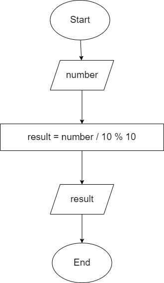
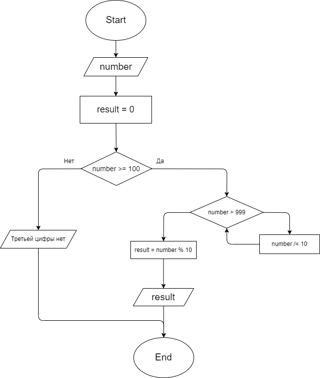
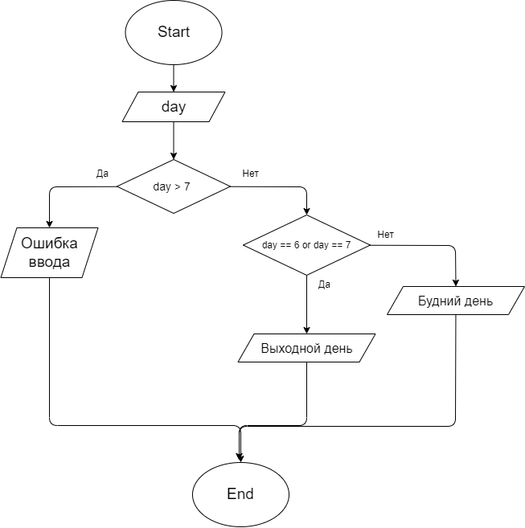

# Задача 10
**Напишите программу, которая принимает на вход трёхзначное число и на выходе показывает вторую цифру этого числа.**

 | [Код](HW005/Program.cs)

# Задача 13
**Напишите программу, которая выводит третью цифру заданного числа или сообщает, что третьей цифры нет.**

 | [Код](HW006/Program.cs)

# Задача 15
**Напишите программу, которая принимает на вход цифру, обозначающую день недели, и проверяет, является ли этот день выходным.**

 | [Код](HW007/Program.cs)