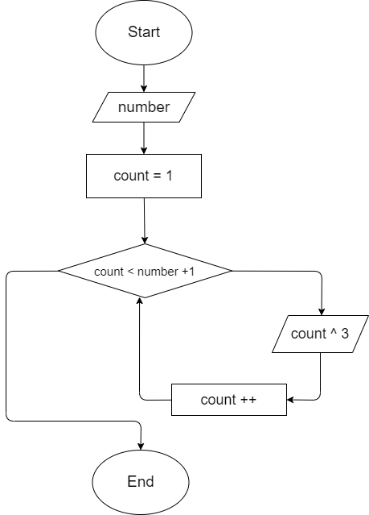
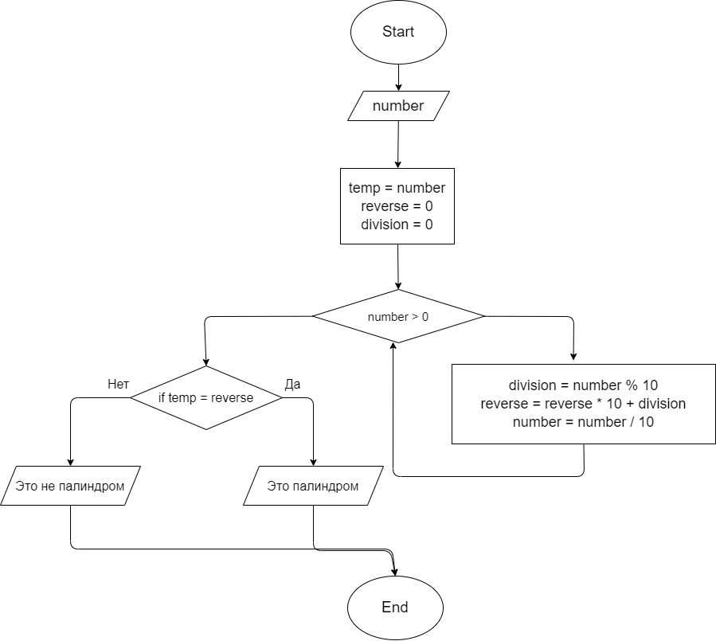

# Задача 23
**Напишите программу, которая принимает на вход число (N) и выдаёт таблицу кубов чисел от 1 до N.**

 | [Код](HW008/Program.cs)

# Задача 19
**Напишите программу, которая принимает на вход пятизначное число и проверяет, является ли оно палиндромом.**

 | [Код](HW009/Program.cs)

