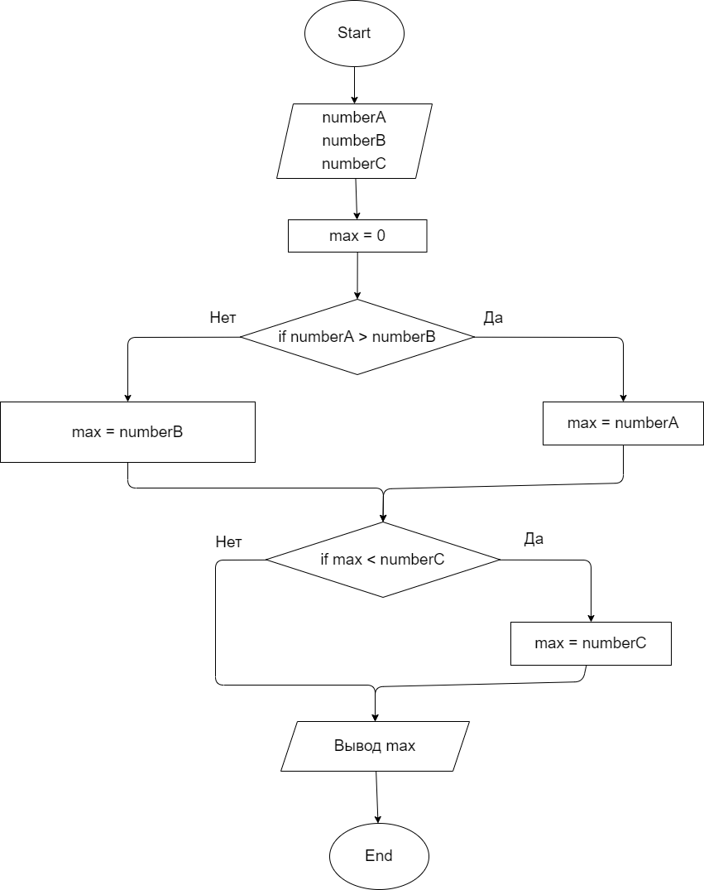
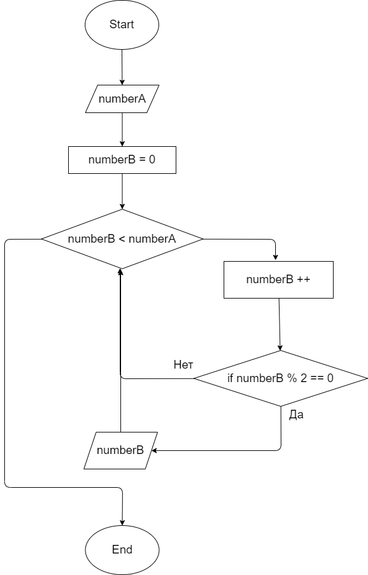
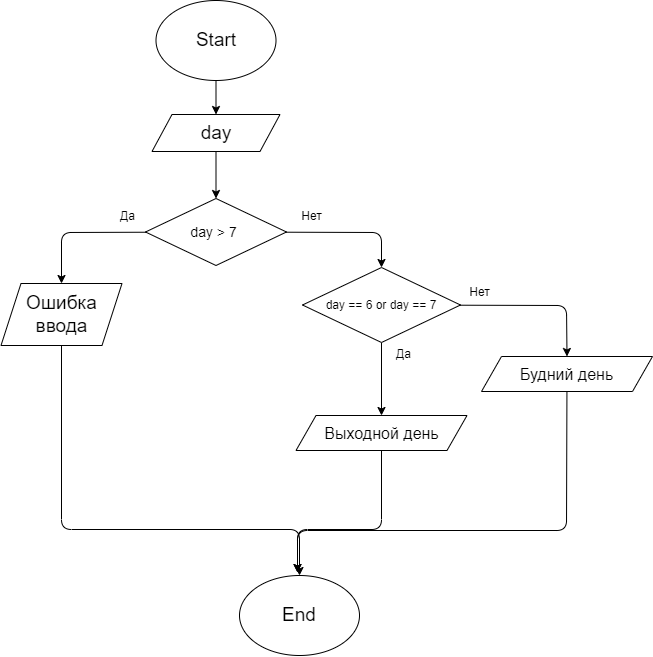

# Задача 1 
**Напишите программу, которая на вход принимает два числа и выдаёт, какое число большее, а какое меньшее.**

 | [Код](HW001/Program.cs)

# Задача 2 
**Напишите программу, которая принимает на вход три числа и выдаёт максимальное из этих чисел.**

 | [Код](HW002/Program.cs)

# Задача 3
**Напишите программу, которая на вход принимает число и выдаёт, является ли число чётным (делится ли оно на два без остатка).**

 | [Код](HW003/Program.cs)

# Задача 4
 **Напишите программу, которая на вход принимает число (N), а на выходе показывает все чётные числа от 1 до N.**

 | [Код](HW004/Program.cs)

# Задача 5
**Напишите программу, которая принимает на вход трёхзначное число и на выходе показывает вторую цифру этого числа.**

 | [Код](HW005/Program.cs)

# Задача 6
**Напишите программу, которая выводит третью цифру заданного числа или сообщает, что третьей цифры нет.**

 | [Код](HW006/Program.cs)

# Задача 7
**Напишите программу, которая принимает на вход цифру, обозначающую день недели, и проверяет, является ли этот день выходным.**

 | [Код](HW007/Program.cs)